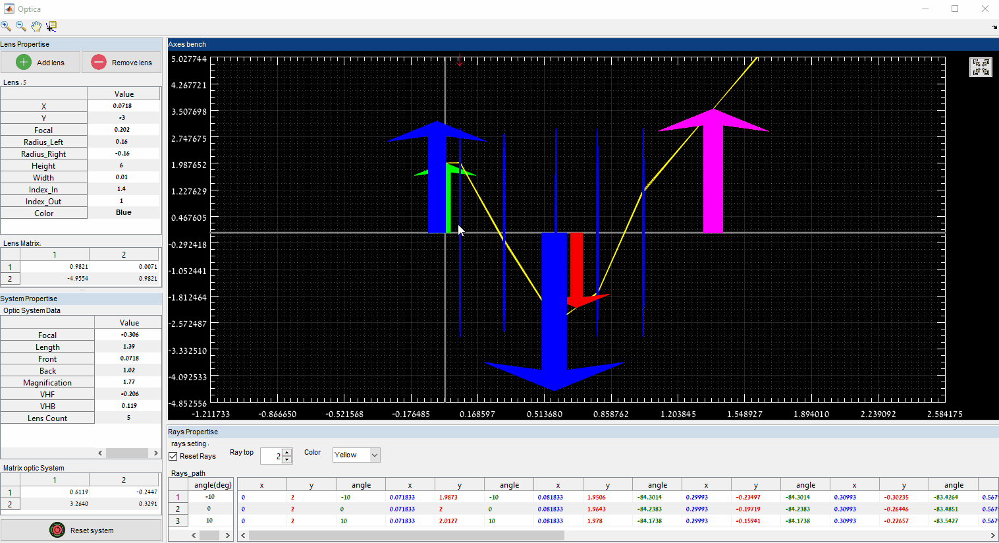

# Optica
Optics - Simulation of optics lenses and tracking of light rays
This software simulates the optical system through which you can:

🔍 Key Features of the Software
Multiple Lens Support

1. Add, modify, or remove multiple lenses on the optical axis.
   Lenses can have different radii, refractive indices, thicknesses, and shapes (e.g., convex, concave).

2. Ray Tracing
   Simulates how light rays propagate and bend through each lens.
   For rays:
   Incident and refracted angles.
   Ray paths and intersections.

3. Shows both real and virtual image locations.

4. Optical Parameters Display
   For each lens:
   Left and right radius of curvature.
   Refractive index.
   Focal length (automatically computed).

5. Image Formation
   Display where the image forms (real/virtual).
   Can show magnification and orientation (inverted/upright).

6. Graphical User Interface (GUI)
   Interactive drag-and-drop interface for adding lenses and rays.
   Real-time updates of ray paths when properties are changed.

for more matlab project go to:
[matlab project](https://www.mathworks.com/matlabcentral/profile/authors/3931123-oren-berkovicth)

created by Oren Berkovitch 

icons attribue:
Icons made by <a href="https://www.flaticon.com/authors/smashicons" title="Smashicons">Smashicons</a> from <a href="https://www.flaticon.com/" title="Flaticon"> www.flaticon.com</a>

Icons made by <a href="https://www.flaticon.com/authors/alfredo-hernandez" title="Alfredo Hernandez">Alfredo Hernandez</a> from <a href="https://www.flaticon.com/" 
title="Flaticon"> www.flaticon.com</a>

Icons made by <a href="http://www.freepik.com/" title="Freepik">Freepik</a> from <a href="https://www.flaticon.com/" title="Flaticon"> www.flaticon.com</a>

 email : orenber@hotmail.com
